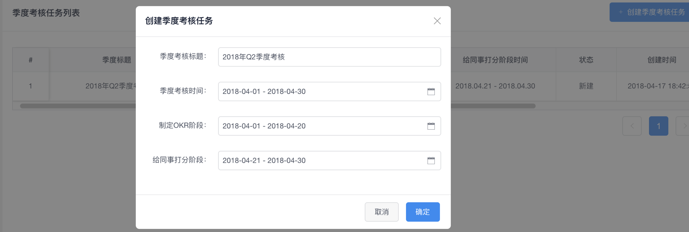
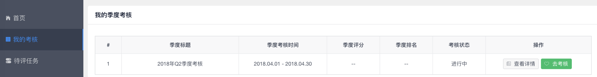
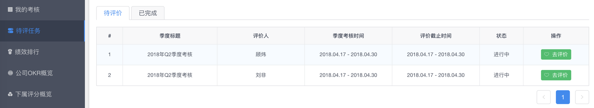
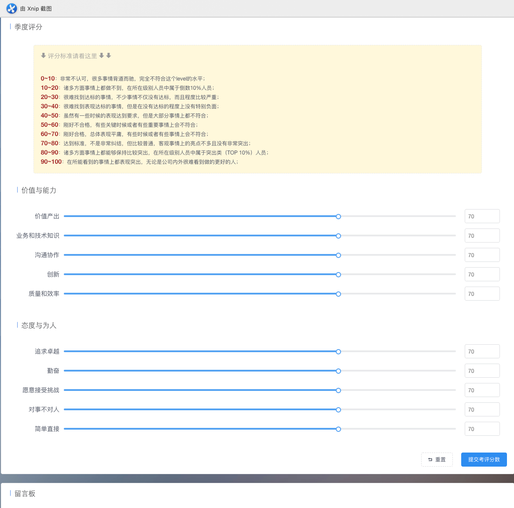
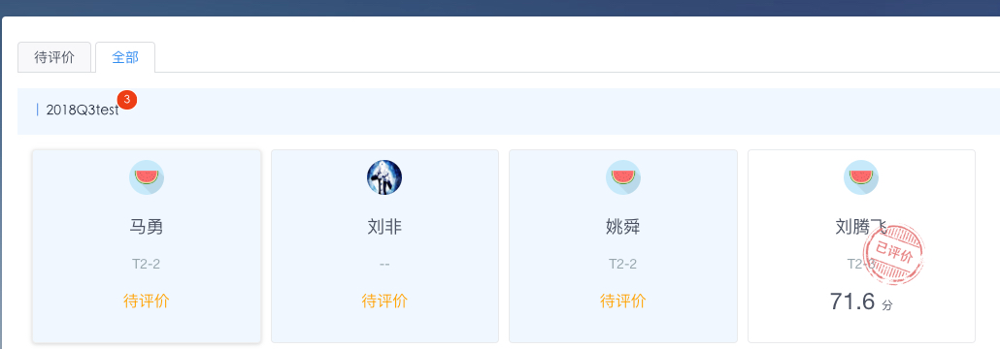
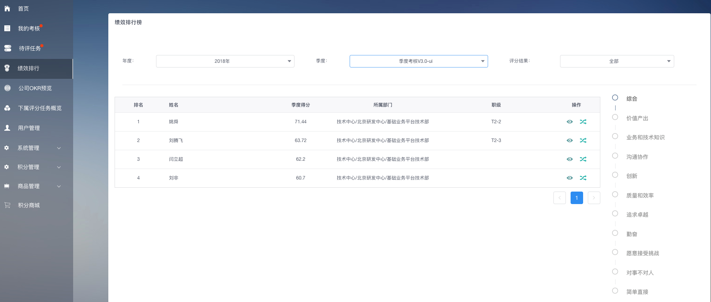
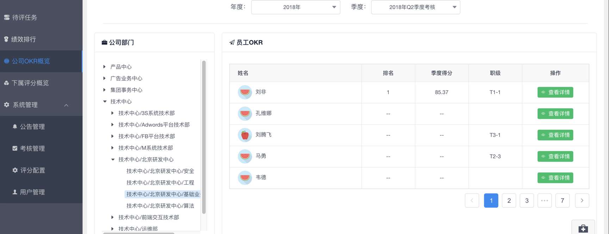
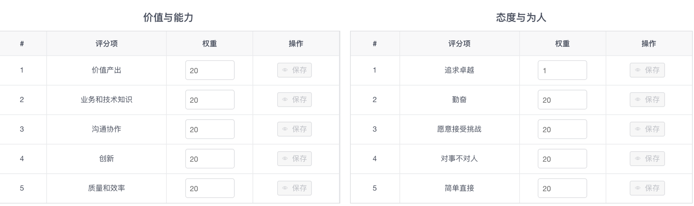

## </img> 使用说明


### 1.概述 OKR (Objectives and Key)
```
    Results)全称为“目标和关键成果”，是企业进行目标管理的一个简单有效的系统，能够将目标管理自上而下贯穿到基层。
    OKR是一套定义和跟踪目标及其完成情况的管理工具和方法。
    1999年 英特尔公司发明了这种方法,后来被 John Doerr推广到甲骨文,谷歌,领英等高科技公司并逐步流传开来。
    现在广泛应用于IT、风险投资、游戏、创意等以项目为主要经营单位的大小企业。
    
    注：引用参考http://wiki.mbalib.com/wiki/OKR
```

#### 1.1基本方法与原则 1.1.1基本方法
```
    1) 首先，要设定一个“目标”（Objective），这个目标不必是确切的、可衡量的，例如“我想让我的网站更好”。
    2) 然后，设定若干可以量化的“关键结果”（Key Results），用来帮助自己实现目标，例如“让网站速度加快30%”之类的具体目标。
```


#### 1.1.2原则
```
    1)OKRs要是可量化的（时间&数量），比如不能说“使gmail达到成功”而是“在9月上线gmail并在11月有100万用户”
    2)目标要是有野心的，有一些挑战的，有些让你不舒服的。
    3)每个人的OKRs在全公司都是公开透明的。比如每个人的介绍页里面就放着他们的OKRs的记录，包括内容和评分。
    
    注：参考http://wiki.mbalib.com/wiki/OKR
```
### 2.使用说明
#### 2.1登录方式
```
    域名：http://okr.mobvista.com/
    账号：使用账号中心账号登录，电子邮件&密码形式。

```


#### 2.2操作流程
##### 2.2.1发布考核通知
    操作对象：管理员


    说明：季度考核开始之前，由管理员发布考核通知，内容自定义。
    点击“发布公告”按钮后，okr系统用户在首页会看到公告内容。如下图：


#####  2.2.2创建考核任务
    操作对象：管理员



```
    说明：
        1)季度考核标题：当前季度考核标题
        2)季度考核时间：当前季度考核时间范围
        3)制定OKR阶段：员工填写OKR时间段
        4)同事打分阶段：在该时间段内员工需完成互相平分
```


    点击“确定”按钮，弹出框关闭，如下图：


```
    1) 修改：对创建的季度考核任务进行修改
    2) 发布：发布当前考核任务，注意：发布时，制定OKR阶段结束时间不能小于当前时间，且发布后不能“修改”、“删除”等。
        发布后，系统用户在“我的考核”看到发布的季度考核任务。
    3) 删除：删除当前季度考核任务
    4) 考核进度：考核任务发布成功之后，“考核进度”按钮亮起，可查看当前考核任务进度。
        如：未填写OKR目标 和 未评价他人

```

#### 2.2.3我的考核
    季度考核任务发布成功之后，在“我的考核”模块看到当前进行的考核任务，如下图：




```
    说明：
    
    1)查看详情：查看用户当前季度考核详情
    2)去考核：当前任务为“进行中”时，点击“去考核”可填写OKR目标和选择考核对象

```
#### 2.2.4填写OKR目标


```
    说明：
    1) 取消：放弃当前录入的OKR目标内容
    2) 提交：保存当前OKR目标内容
```


```
    说明：
    1) 修改：对当前OKR目标进行修改
    2) 加号：点击“加号”按钮，可录入多个OKR目标，最多可以录入5个OKR目标
    3) 下一步：进入下一操作“选择考评对象
```

#### 2.2.5选择考核对象


```
    说明：
    
    1) 选择考评对象：选择你所需要评价的对象，在同事相互考评阶段开始后，在“待评任务”列表可看到需要评价的任务
    2) 上一步：返回上一步，填写OKR目标
    3) 制定OKR目标和选择考评对象阶段都已经完成，请等待同事互评阶段开始。
    4) 完成：点击“完成”操作后，在同事互评阶段开始之前，依然可以对OKR目标和考评对象进行重新填写和选择，如下图。

```


#### 2.2.6为考评对象打分
    在同事互评阶段开始后，可在“待评任务”列表对你所选择的评价对象进行评价和打分。


```
    说明：
    
    1) 待评价：未做出评价的任务
    2) 已完成：已经评价完成的任务
    3) 去评价：为当前考评对象评分
```

##### 评价–标签


```
    说明：
    
    1)对当前考评对象打标签
```


##### 评价–评分



```
    说明：
    
    1)  对当前考评对象进行评分，满分100，具体评分规则可点击帮助按钮获悉，

```
##### 评价--评论


```
    说明：
    1) 对当前考评对象评论
```


##### 评价–评价完成


```
    说明：
    
    评价完成之后，在“全部” 列表可以查看已经做出评价的任务
```

#### 2.2.7考核结束 考核结束后，生成绩效评分和排名。

绩效排行


```
    说明：
    
    1) 评分维度：评分维度11项（综合+10个评分项），可查询各个维度评分和排名
    2) 评价结果：分为 全部 和 正式。只有符合评比规则的才可以在“正式”条件查询中看到。
    
    例如：规则 为T1需要1人评价，T2需要2人评价，T3需要3人评价。
    当 最终评价人数量/需要评价的数量>= 0.7（需要达到的评价比例） 则认为是正式结果，否则为无效结果。
    例如：一个T2级别用户，需要2人评价。如果最终只有1人对他进行评价，1/2=0.5，由于0.5<0.7，所以这个用户的评分结果为无效。
    查看详情：可以查看当前用户的考核详情
```


##### 下属OKR概览


```
    说明：
    
    为保证公平公正评分，上级领导可看到下属对其他人的评价详情。
```


##### 公司OKR概览


```
    说明：
    
    可查询公司各部门的OKR概况。
```

#### 2.2.8其他模块

    评分配置


```
    说明：
    
    可设置各个评分项权重，最大值20
```


    用户管理


```
    说明：
    
    1）对公司用户数据更新维护，目前可修改：职级
    2）点击人员超链接跳转概览页
```


    帮助


```
    说明：
    点击“帮助”按钮，会对当前页面截图，且可编辑。录入问题内容，点击“提交”按钮，会向okr@mobvista.com群组发送反馈信息。

```


```
    其他
    注意：目前OKR考核功能暂时只对“工程中心”部门下的所有人员开放。
    使用过程中如有问题，可通过页面反馈按钮提交反馈，也可直接发送邮件到okr@mobvista.com。
```