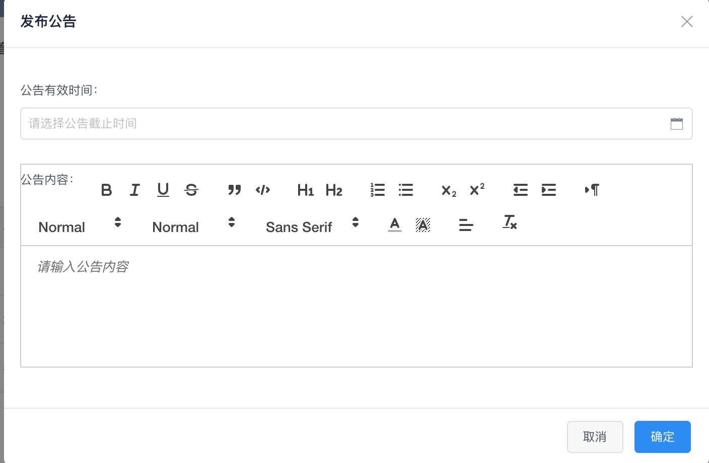
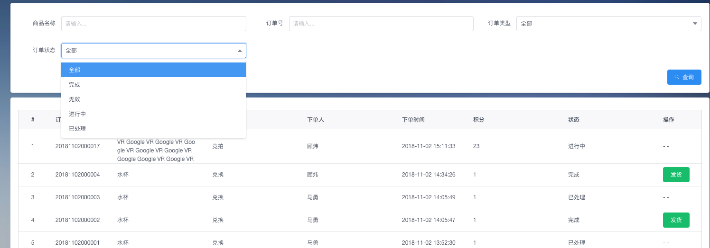
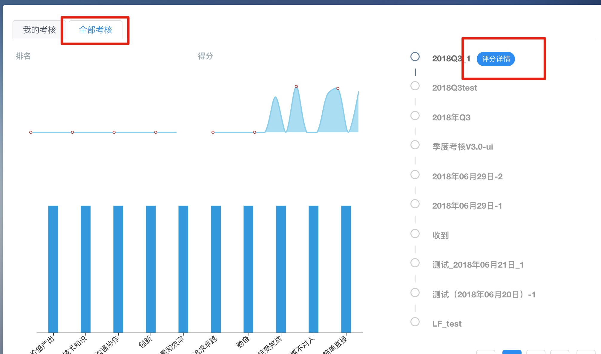
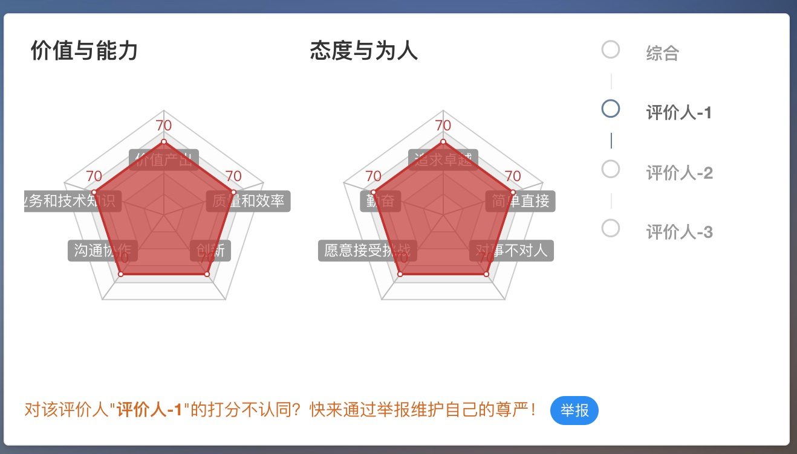
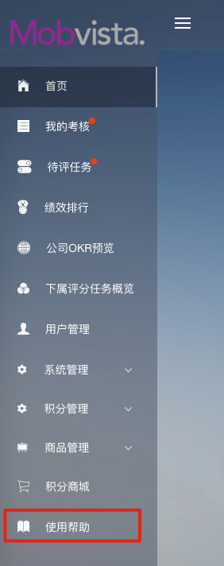
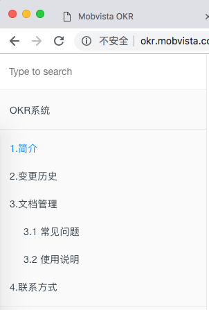
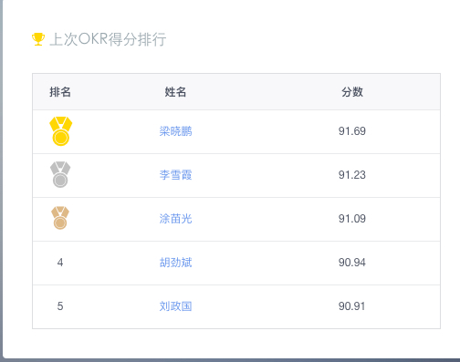
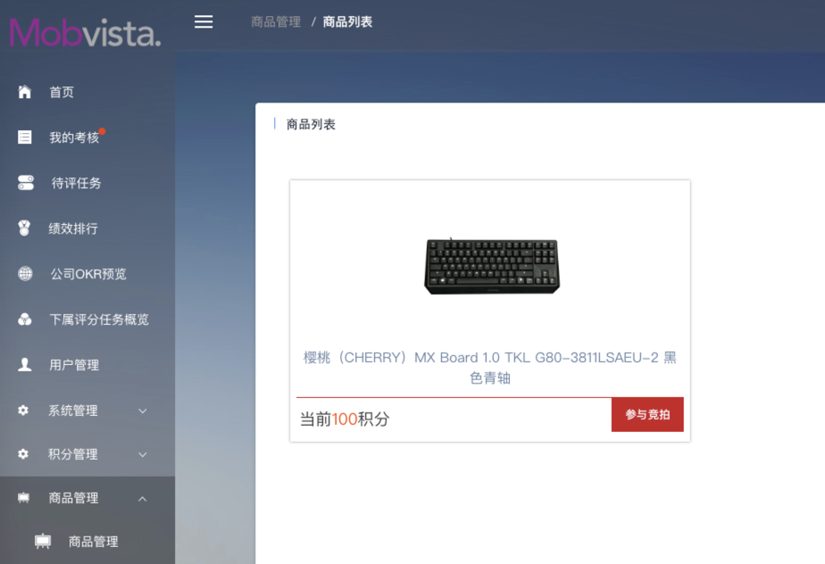
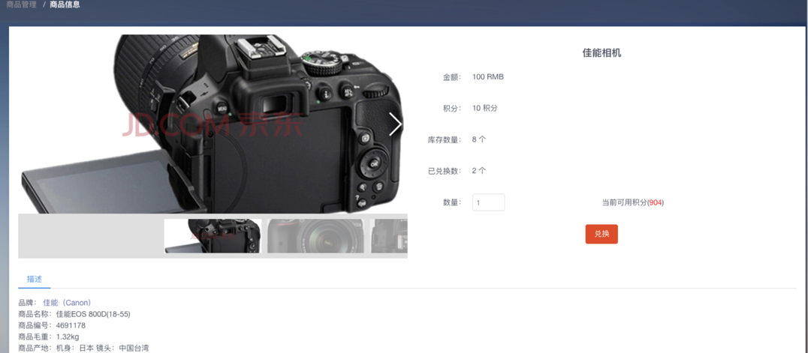
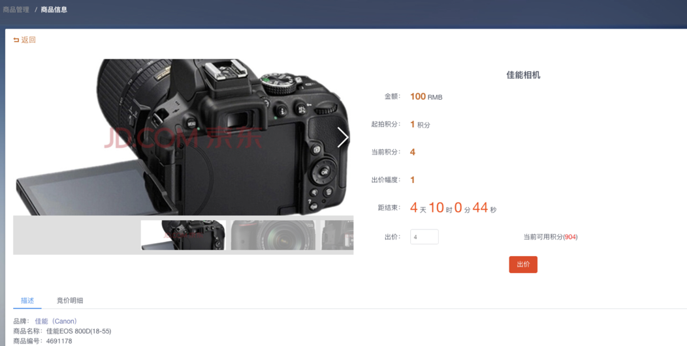

# Release Notes

## </img> v3.3
#### 版本变更（2018年11月01日）

> 1. 积分商城，库存不足提示优化
> 2. 邮件提醒功能。包含：商品上下架、竞拍、兑换。
> 3. 公告管理支持富文本。

> 4. 下属评分任务概览，详情页面优化。
> 5. 积分商城，safari浏览器兼容优化
> 6. 订单管理，增加查询条件，和订单商品发放处理
>
> 7. 增加举报成功奖励积分的功能
> 8. 积分规则中，扣减类积分显示负数

## </img> v3.2.1
#### 版本变更（2018年10月12日）

> 1. 我的考核 - 全部考核，查看考核详情
>  
> 2. 举报功能
>  我的考核 - 全部考核，点击详情可以看到举报入库，所有人觉得评分不合理，都可以举报
>  
> 3. 举报管理功能优化

## </img> v3.2
#### 版本变更（2018年10月12日）

> 1. OKR文档功能模块
> > 功能说明：点击右侧菜单，查看OKR相关文档说明  
> > 
> >
> > 日志模块：
> >
> > 
>
> 2. OKR目标考核显示排序，根据填写顺序显示
> 3. 商品自动上架功能
> 4. 首页“OKR得分排行”更名“最近一次OKR得分排行”
> >

## </img> v3.1
#### 版本变更（2018年09月21日）

> 1. 积分商城
> > 功能说明：可查看所有上架的商品。点击商品进入详情页面进行兑换或竞拍。  
> > 
> 2. 积分兑换
> > 功能说明：选择兑换的数量，点击兑换按钮进行积分兑换。兑换成功后，可在订单管理中查看到已成功兑换的商品。
> > 
> 2. 积分竞拍
> > 功能说明：多个用户竞拍同一件商品，在截止日结束前出价高者获得此商品。
> > 

## </img> v3.0

#### 版本变更（2018年09月3日）

> 1. 样式改版优化

## </img> v2.5

#### 版本变更（2018年07月27日）

> 1. 积分管理功能(用户积分，积分规则)
> > 1. 用户积分。显示所有用户积分信息，详情查看用户积分流水
>>
> > 2. 积分规则。创建对应触发方式的积分规则，根据规则发放、消减积分。
>>
> 2. 积分规则对应实现逻辑
> > 1. 积分管理考核结束时，根据触发方式触发对应积分规则对用户进行积分发放、消减

## </img> v2.4
#### 版本变更（2018年07月17日）

> 1. 绩效排行增加用户对比功能
> 
> 
>
> 2. 用户考核管理增加计数统计功能
> 
> 3. 用户管理排除离职用户

## </img> v2.3
#### 版本变更（2018年07月17日）

> 1. 规则调整，人数修改，其他部门必须是跨大部门，例如：运维、QA、3S等部门
> 2. 填写okr目标和选择考核对象增加提示“评价人数提示：你已选择10人， 被0人选择 （至少需要被 5人选择）。”
> 
>
> 3. 直属上级也可以查看下属OKR目标，原功能只支持部门领导可以查看
> 4. 离职人员对系统功能影响梳理并完善，具体如下：
>> 1. 生成评价任务时，排除离职人员，如果排除后人数不符合规则，按正常情况处理。
>> 2. 生成评价任务后，评价人离职。如果评价人已作出评价，正常计算评分；如果评价人未作出评价，按照未评分处理。
>> 3. 在“查看下属OKR目标”，直属上级和部门领导可查看离职下属对其他人的评分
>> 4. 在当前季度考核中，如果人员离职，考核结束后正常显示离职人员分数和排名
>> 5. 发送邮件屏蔽离职人员
>> 6. 发布任务时排除离职人员
>> 7. 选择考核对象的时候，人员离职。使用红色标识出离职用户，并置灰，提醒用户再选择其他考核对象。
>
>5. 举报按钮操作权限优化
>6. 考核状态优化，已经结束的季度考核状态更改为“已结束”
>7. 考核失败，记录考核失败具体原因

